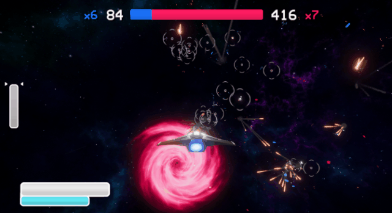

# Alkis Spaceships
A minigame of laser dogfights in space.

## About

The game features spaceship models by [Alkis Tagaras](https://www.artstation.com/alkis-3d) (hence the working title) and music by Georgie Bogie.

Its main purpose was to showcase Alkis' 3D art (which however has improved even more since then, see [his ArtStation](https://www.artstation.com/artwork/d8lNYK)),
and it was also an opportunity for me to experiment with a cleaner and more structured coding style.

I have open sourced the project as a portfolio piece, and in the hopes that it will be helpful to others. Contributions are always welcome.

## Features

* 75 vs 75 team deathmatch with bots
* Domination-style score system with multipliers
* Customizable controls (with gamepad support)
* Minimalistic menus with animation and sounds

## Usage

Quick link to play: **[Download game](https://github.com/kostasvs/Alkis/releases/tag/v1.0)**

Made with Unity 2019.2. Upon cloning, you should be able to run immediately in Unity test mode, or build and run.

Currently designed for standalone only (Windows/Mac/Linux). Ingame controls can use gamepad, but the menu currently requires a mouse.

## License

Distributed under the MIT License. See `LICENSE` for more information.

## Contact

Kostas Ventouras - [@kostasvs](https://github.com/kostasvs)

Project Link: [https://github.com/kostasvs/Alkis](https://github.com/kostasvs/Alkis)
