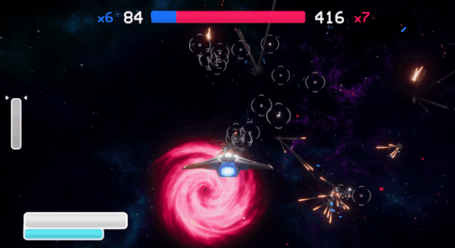

# Alkis Spaceships
A minigame of laser dogfights in space.

## About

The game features spaceship models by [Alkis Tagaras](https://www.artstation.com/alkis-3d) (hence the working title) and music by Georgie Bogie.

Its main purpose was to showcase Alkis' 3D art (which however has improved even more since then, see [his ArtStation](https://www.artstation.com/artwork/d8lNYK)),
and it was also an opportunity for me to experiment with a cleaner and more structured coding style.

I have open sourced the project as a portfolio piece, and in the hopes that it will be helpful to others. Contributions are always welcome.

- Originally made in Unity 2019.2, later upgraded to Unity 6
- Uses built-in render pipeline and legacy input system. There are some code provisions for the new input system (see `SSControlPlayer` script) but I had found that the new input system was unstable at that time so I did not complete the migration.

## Features

* 75 vs 75 team deathmatch with bots
* Domination-style score system with multipliers
* Customizable controls (with gamepad support)
* Minimalistic menus with animation and sounds

## Default controls

- Turn: WSAD
- Thrust Increase: Left Mouse Button
- Thrust Decrease: Right Mouse Button
- Shoot: Left Control
- Look Back: Left Shift

## Usage

Quick link to play: **[Download game](https://github.com/kostasvs/Alkis/releases/tag/v1.0)**

Currently designed for standalone only (Windows/Mac/Linux). Ingame controls can use gamepad, but the menu currently requires a mouse.

## License

Distributed under the MIT License. See `LICENSE` for more information.

## Contact

Kostas Ventouras - [@kostasvs](https://github.com/kostasvs)

Alkis Tagaras - [@AlkisTag](https://github.com/AlkisTag)
